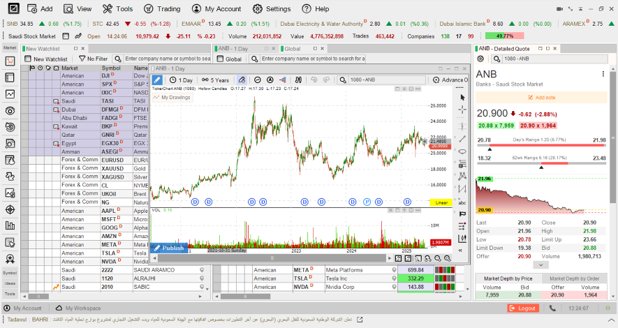
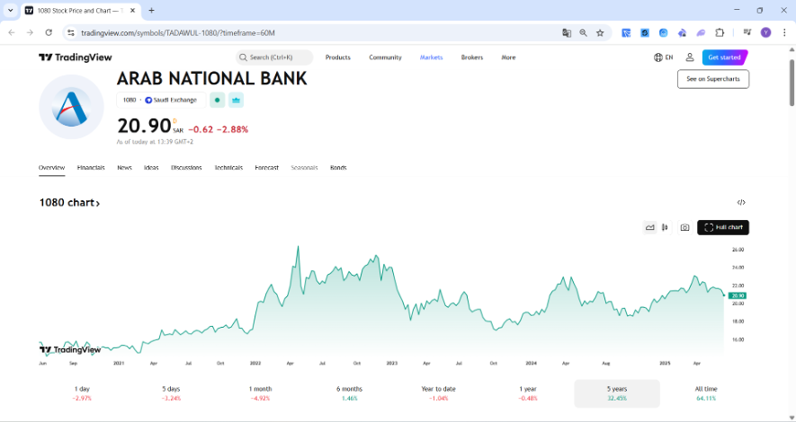
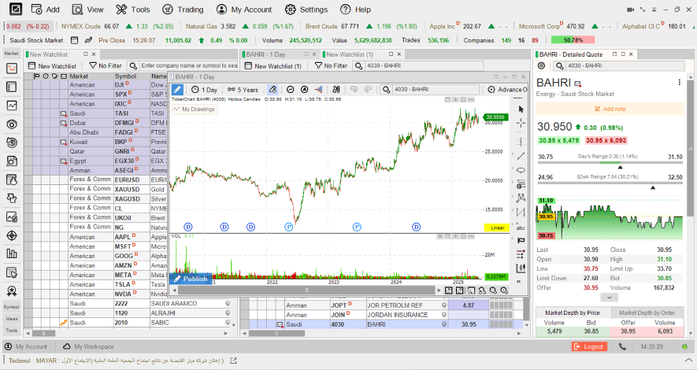
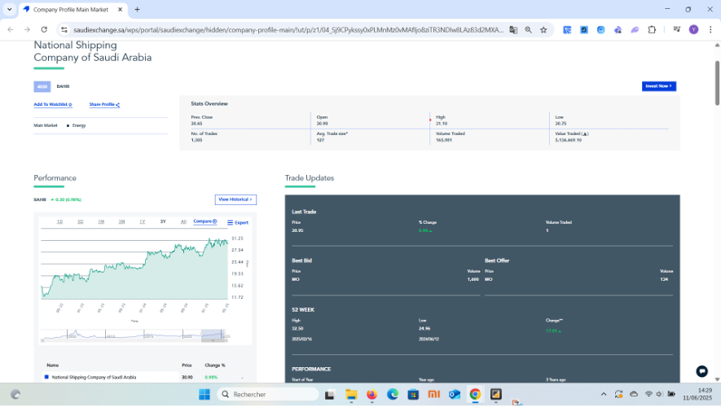
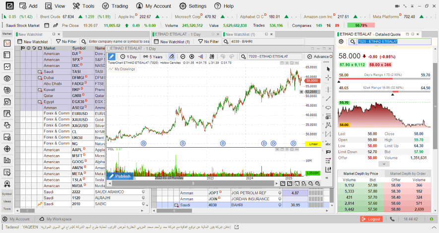
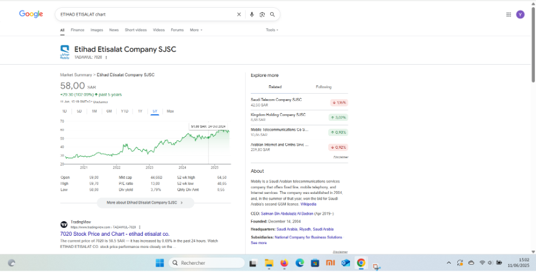

# 9. Appendix (Examples)

**Banking**

_Arab National Bank - 1080_

The ANB stock is showing a satisfying daily volume, with a satisfying daily bid and ask volumes, as well as periods during which a market depth bid volume/price reached 4 times the market depth ask volume/price (see below this particular example for instance), which may lead us to suppose that there is more demand coming from the retail investors / lack of liquidity provider (markets makers) within the saudi market.

<figure><figcaption></figcaption></figure>

The ANB stock has been showing consistent growth (see 2nd chart) for the last five years (this is an important factor to take into consideration for _pieces of the strategy that are partially hedged_, in order to avoid significantly decreasing the overall P\&L by systematically fully-hedging the inventory). In other words, a significant stock price increase which will add an additional performance to the performance coming from the collected spreads from the market making daily activity.

<figure><figcaption></figcaption></figure>

**Energy**

BAHRI _(Formerly known as National Shipping Company of Saudi Arabia)_ - 4030

\
The BAHRI stock is showing a satisfying daily volume, with a satisfying daily bid and ask volumes and satisfying market depth volume by price.

<figure><figcaption></figcaption></figure>

&#x20;The Bahri stock has been showing consistent growth for the last couple of years as well, meaning a potential additional performance on the top of the market making daily profits. (see below the 3-years chart)

<figure><figcaption></figcaption></figure>

**Telecommunications**

Etihad Etisalat Company - 7020

The Etihad Etisalat Company stock is showing a satisfying daily volume, with a satisfying daily bid and ask volumes and satisfying market depth volume by price ;

as well as periods during which a market depth bid volume by price reached 24 times the market depth ask volume/price (cf. below the following example for instance)\
This huge gap in the orderbook market depth volumes by price, may lead us to assume that there is a way more demand coming from the retail investors, as the few liquidity providers out there would most likely provide a balanced inventory (supply / demand) as they would generally not take such a systematic risk.

<figure><figcaption></figcaption></figure>

The Etihad Etisalat Company stock has been showing a consistent growth for the last couple of years as well, in fact the stock price doubled in value within the last five years, meaning a significant additional performance on the top of the market making daily profits. (see below the 5-years chart)

<figure><figcaption></figcaption></figure>

_**NOTE: These examples are extracted from external sources and may vary!**_&#x20;
