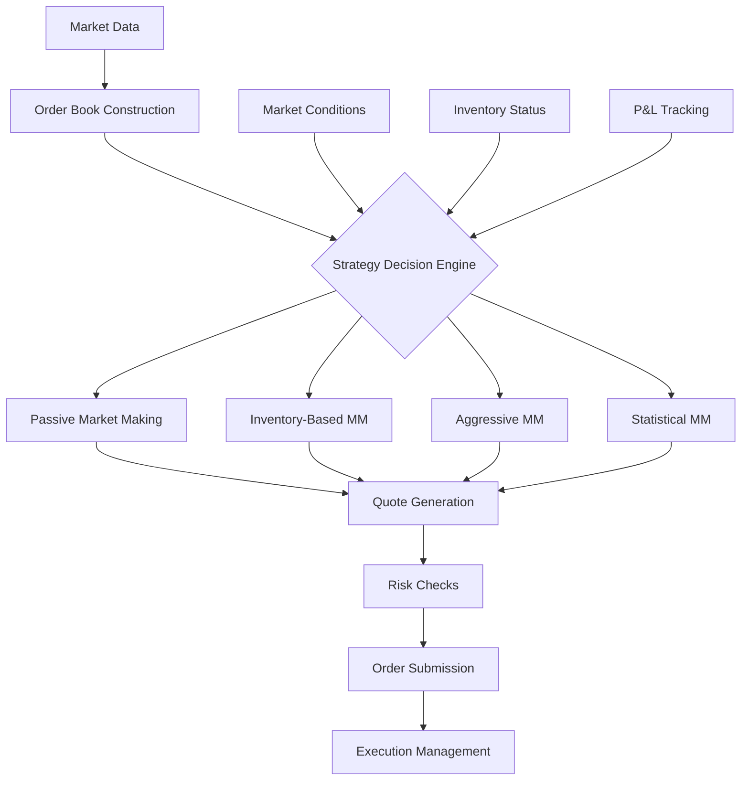

# 2.1 Strategy Components

```mermaid
graph TD
    A[Market Data] --> B[Order Book Construction]
    B --> C{Strategy Decision Engine}
    C --> D[Passive Market Making]
    C --> E[Inventory-Based MM]
    C --> F[Aggressive MM]
    C --> G[Statistical MM]
    
    D --> H[Quote Generation]
    E --> H
    F --> H
    G --> H
    
    H --> I[Risk Checks]
    I --> J[Order Submission]
    J --> K[Execution Management]
    
    L[Market Conditions] --> C
    M[Inventory Status] --> C
    N[P&L Tracking] --> C
```
